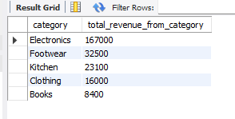
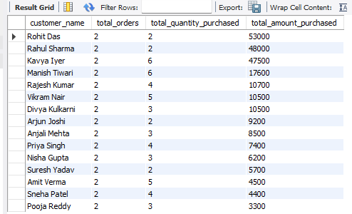
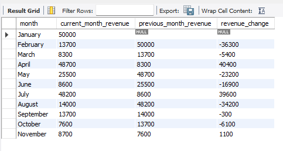
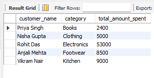
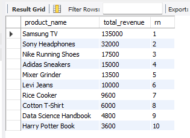

# 🛒 Retail Sales SQL Analysis

## 📌 Project Overview

A comprehensive SQL-based business analysis project built on a retail sales database. This project simulates real-world business problem-solving by analyzing customer behavior, product performance, and revenue trends using advanced SQL techniques in MySQL.

## 🚀 Project Goal

To analyze retail sales data and generate actionable business insights using SQL, simulating tasks commonly performed by Data Analysts in real-world business environments.

## 🎯 Skills Demonstrated

* SQL Joins
* Data Aggregation
* Business KPI Analysis
* Customer Analytics
* Revenue Analysis
* Common Table Expressions (CTEs)
* Window Functions
* Data Ranking Techniques
* Trend Analysis

## 🗃️ Database Schema

Three related tables form the foundation of this project:

| Table     | Columns                                                         |
| --------- | --------------------------------------------------------------- |
| Customers | customer_id, customer_name, city                                |
| Products  | product_id, product_name, category                              |
| Orders    | order_id, customer_id, product_id, quantity, amount, order_date |

## 📂 Repository Structure

```text
Retail-Sales-SQL-Project/
│
├── schema.sql
├── data.sql
├── analysis.sql
├── README.md
└── outputs/
    ├── revenue_by_category.png
    ├── customer_lifetime_value.png
    ├── month_over_month_growth.png
    ├── top_customer_per_category.png
    └── product_revenue_ranking.png
```

## 📊 Business Questions Answered

### Basic Analysis

1. What is the total revenue generated?
2. Which product category generates the most revenue?
3. Who are the top 5 customers by total spending?
4. What is the monthly revenue trend?
5. Which product sells the most by quantity?

### Intermediate Analysis

6. Which are the top 3 cities by revenue?
7. What is the average order value?
8. Which category gets ordered most frequently?
9. Which customers have placed repeat orders?

### Advanced Analysis

10. What is the running revenue trend over time?
11. What is each category's revenue contribution percentage?
12. What is the lifetime value of each customer?
13. Who is the top spending customer in each category?
14. What is the month-over-month revenue growth?
15. How do products rank by total revenue?

## 🧠 SQL Concepts Used

| Concept                         | Applied In                     |
| ------------------------------- | ------------------------------ |
| JOINs                           | Most queries                   |
| GROUP BY + Aggregate Functions  | Basic and Intermediate queries |
| CTEs (Common Table Expressions) | Advanced queries               |
| Window Functions (SUM OVER)     | Running Revenue Trend          |
| RANK() + PARTITION BY           | Top Customer per Category      |
| DENSE_RANK()                    | Product Revenue Ranking        |
| LAG()                           | Month-over-Month Growth        |

## 💡 Key Business Insights

* Electronics generated 67.6% of total company revenue, making it the most valuable category.
* Rohit Das was the highest-value customer with a lifetime spend of ₹53,000.
* The top 3 customers contributed ₹148,500 in combined revenue.
* Samsung TV was the highest revenue-generating product in the catalog.

## 📸 Sample Outputs

### Revenue by Category



### Customer Lifetime Value



### Month-over-Month Difference



### Top Customer per Category



### Product Revenue Ranking



## 🛠️ Tools Used

* MySQL
* MySQL Workbench

## 📁 Files

| File         | Description                                        |
| ------------ | -------------------------------------------------- |
| schema.sql   | Database creation and table structure              |
| data.sql     | Sample data insertion scripts                      |
| analysis.sql | Business analysis queries                          |
| outputs/     | Screenshots of query results and business insights |

## 👨‍💻 Author

**Abhinibesh Mal**

Aspiring Data Analyst skilled in SQL, Excel, Python, Power BI, and Data Analytics.
